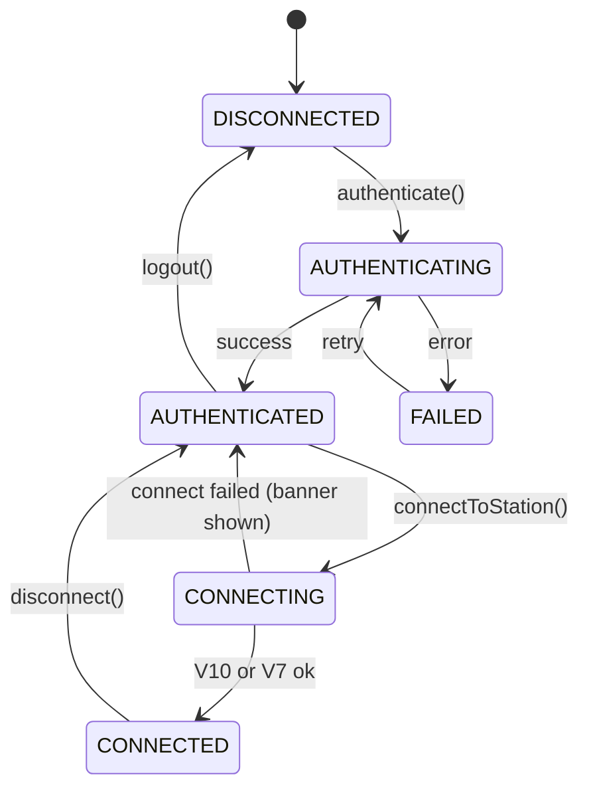
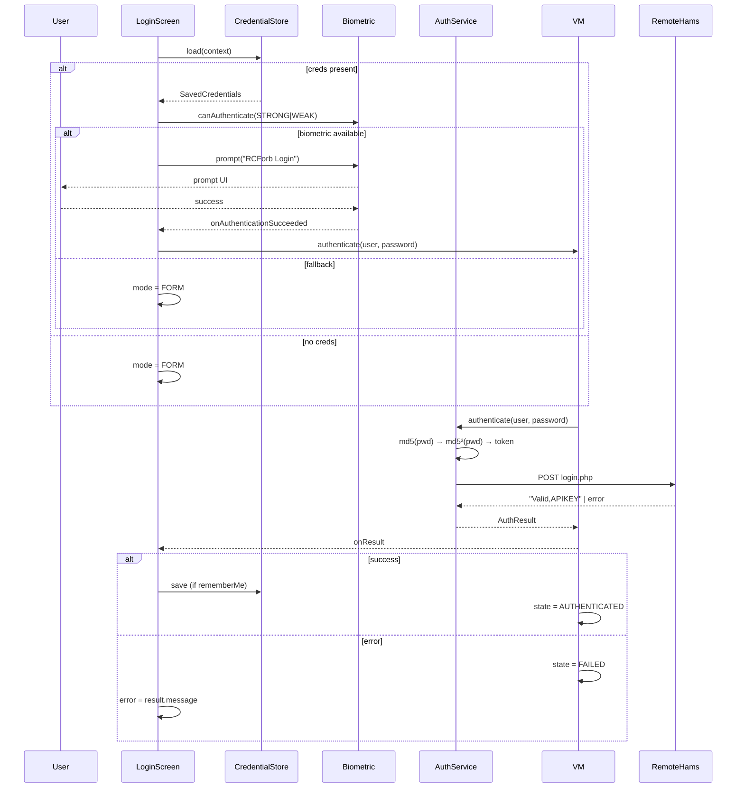
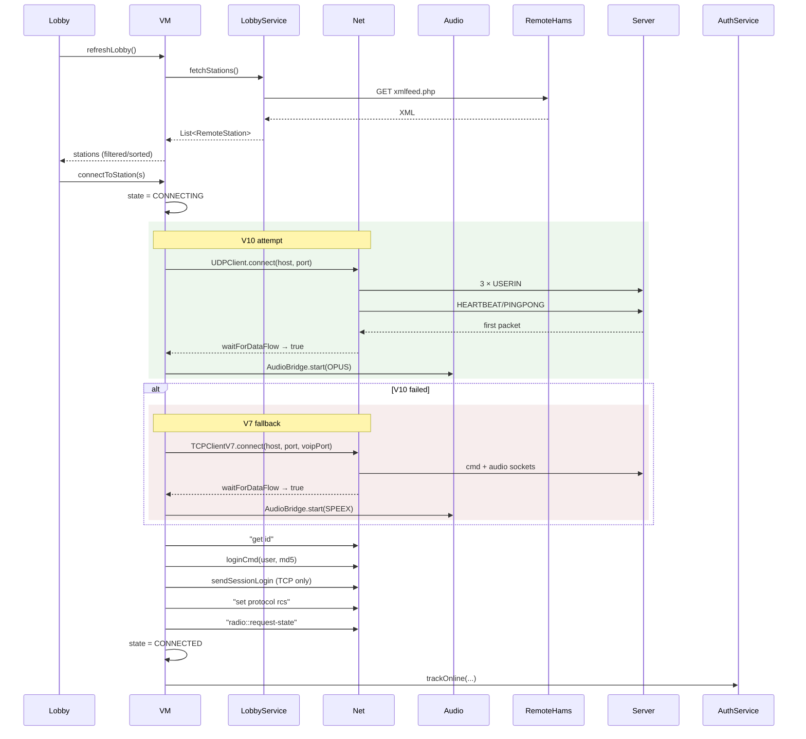
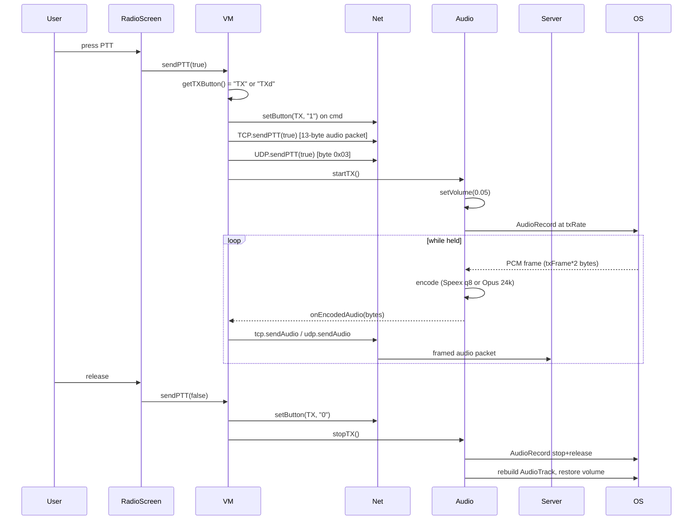
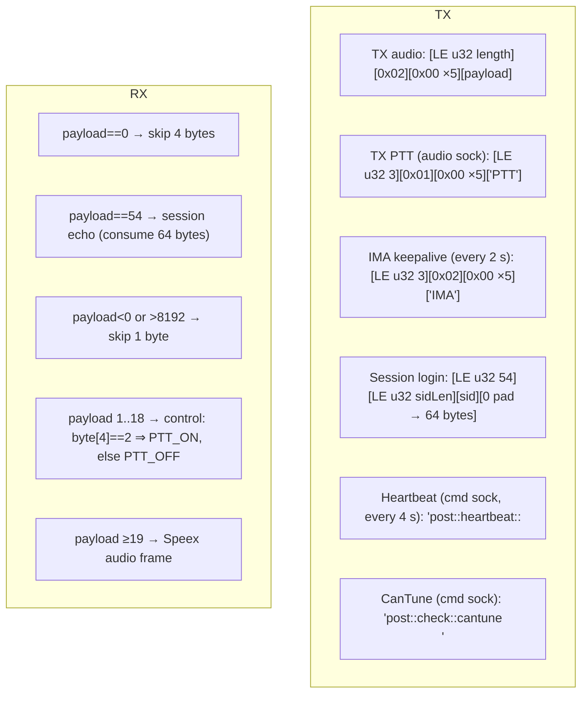

# RCForb — Canonical Porting Specification

> Version 1.0 · 2026-04-29 · Source of truth: `android/`

This document is the exhaustive, byte-level specification for porting the
RCForb Android client to **macOS (Apple Silicon, Kotlin)**, **iOS (Kotlin
Native)**, **Linux (Kotlin)** and **Windows (Kotlin)**. The Android module
inside this repository is the **only** source of truth. When a platform port
is requested (e.g. "port to macOS"), this document combined with the Android
source is sufficient to produce a fully functional, bug-for-bug equivalent
client with identical UX, UI, iconography, and protocol behavior.

---

## Table of Contents

1. [Goal & Acceptance Criteria](#1-goal--acceptance-criteria)
2. [Source Manifest](#2-source-manifest)
3. [High-Level Architecture](#3-high-level-architecture)
4. [Module Deep Dive](#4-module-deep-dive)
   1. [Models](#41-models)
   2. [Protocol](#42-protocol)
   3. [Networking](#43-networking)
   4. [Audio](#44-audio)
   5. [Services](#45-services)
   6. [UI — Theme](#46-ui--theme)
   7. [UI — Components](#47-ui--components)
   8. [UI — Screens](#48-ui--screens)
5. [Workflow Diagrams](#5-workflow-diagrams)
6. [Asset, Icon, and Font Inventory](#6-asset-icon-and-font-inventory)
7. [Recommended Cross-Platform Strategy](#7-recommended-cross-platform-strategy)
8. [Shared Module Layout (`commonMain`)](#8-shared-module-layout-commonmain)
9. [Platform Port — macOS](#9-platform-port--macos)
10. [Platform Port — iOS](#10-platform-port--ios)
11. [Platform Port — Linux](#11-platform-port--linux)
12. [Platform Port — Windows](#12-platform-port--windows)
13. [Per-Platform Acceptance Checklist](#13-per-platform-acceptance-checklist)
14. [Known Behavior That Must Be Preserved](#14-known-behavior-that-must-be-preserved)

---

## 1. Goal & Acceptance Criteria

A successful port satisfies **all** of the following:

- Builds and runs natively on the target OS without errors.
- UI parity — identical layout, colors (Nova Olive palette), typography
  (Digital‑7 Mono for frequency/LCD), spacing (dp/sp constants), iconography,
  and gesture behavior to the Android app.
- Functional parity — login (with biometrics where supported), lobby fetch,
  V10/V7 fallback connect, RX/TX audio, PTT, full radio control surface
  (buttons, dropdowns, sliders, meters, status pills, messages), chat,
  rotator/amp/switch peripherals, favorites, volume control, mic test.
- Protocol parity — wire-format identical to Android's
  `TCPClientV7`/`UDPClient` (byte-for-byte packet framing, command strings,
  heartbeat cadence, MD5 token format).
- Codec parity — Speex narrowband 8 kHz quality 8 (V7) and Opus 48 kHz mono
  24 kbps 20 ms (V10).
- App icon — derived from `android/app/src/main/res/drawable/app_icon.png`
  (1024×1024 RGB).
- No new bugs that don't exist in the Android app.

---

## 2. Source Manifest

The Android module is the **canonical source**. Every file below is in
`/Users/moncho/Desktop/RCForb/android/app/src/main/`.

### 2.1 Kotlin sources (35 files)

| File | Purpose |
|------|---------|
| `java/com/rcforb/android/MainActivity.kt` | App entry, top-level Compose host, ConnectionState routing |
| `java/com/rcforb/android/RCForbApplication.kt` | Empty `Application` subclass |
| **Models** | |
| `models/RadioState.kt` | Mutable radio state machine; consumes `radio::*` and chat commands |
| `models/ServerInfoState.kt` | Server identity, radio open/in-use status, chat parsing |
| `models/PeripheralState.kt` | `RotatorStateModel`, `AmpStateModel`, `SwitchStateModel` |
| `models/DataTypes.kt` | Immutable DTOs (`*Data`), enums, `RemoteStation`, `ChatMessage`, `AuthResult`, `SavedCredentials` |
| **Protocol** | |
| `protocol/MD5.kt` | `md5()`, `doubleMD5()`, `validationToken()` helpers |
| `protocol/ProtocolConstants.kt` | `ControlByte` constants, packet classifier, codec params |
| `protocol/CommandParser.kt` | Splits `key::value`, builds command strings |
| **Networking** | |
| `networking/UDPClient.kt` | V10 UDP transport, control bytes, heartbeats, ping |
| `networking/TCPClientV7.kt` | V7 dual-socket TCP (cmd + audio), session login, framing |
| `networking/IpExClient.kt` | NAT punch via `ipex.remotehams.com:7005` (currently unused but must be preserved) |
| **Audio** | |
| `audio/AudioBridge.kt` | RX/TX pipeline, codec switching, volume ducking, mic test |
| `audio/OpusDecoder.kt` | MediaCodec-based Opus decoder (48 kHz mono) |
| `audio/OpusEncoder.kt` | MediaCodec-based Opus encoder |
| `audio/SpeexDecoder.kt` | Native Speex via JNI (8 kHz NB) |
| `audio/SpeexEncoder.kt` | Native Speex encoder, quality 8 |
| `audio/SpeexNative.kt` | JNI bindings (`System.loadLibrary("speex_jni")`) |
| **Services** | |
| `services/AuthService.kt` | OkHttp POST to `api.remotehams.com/v2/login.php` |
| `services/CredentialStore.kt` | XOR(0x5A)+Base64 in SharedPreferences |
| `services/FavoritesStore.kt` | JSON array in SharedPreferences |
| `services/LobbyService.kt` | Fetch + regex-parse `xmlfeed.php` |
| `services/ConnectionManagerViewModel.kt` | Single source of truth for connection lifecycle, command dispatch, audio routing |
| **UI — Theme** | |
| `ui/theme/Color.kt` | Nova Olive `AppColors`, dp/sp constants, `hexColor()` |
| `ui/theme/Theme.kt` | `RCForbTheme` Material3 wrapper, `Modifier.noRippleClickable` |
| **UI — Components** | |
| `ui/components/MetalButton.kt` | Flat rounded button, `LIGHT`/`DARK` styles, on/off state |
| `ui/components/MetalDropdown.kt` | Popover dropdown with cream-on-dark items |
| `ui/components/CompactSlider.kt` | Custom Canvas slider (4 dp track, 6 dp thumb) |
| `ui/components/PanelView.kt` | Title-cased uppercase header + bordered card wrapper |
| `ui/components/ButtonGridView.kt` | 4-column grid for peripheral buttons |
| `ui/components/StatusPillsView.kt` | Horizontally laid out pill chips |
| **UI — Login** | |
| `ui/login/LoginScreen.kt` | Loading/biometric/form modes, RemoteHams login |
| **UI — Lobby** | |
| `ui/lobby/LobbyScreen.kt` | Header + search + StationTable (resizable cols) + favorites sidebar + footer |
| **UI — Radio** | |
| `ui/radio/RadioScreen.kt` | Top bar, LCD hero, mode/filters, controls (knobs + buttons), sliders, status, request/mic-test/PTT |
| `ui/radio/FrequencyDisplay.kt` | 9-digit Digital‑7 Mono display, tap-to-set dialog |
| `ui/radio/VFOKnobView.kt` | Drag-rotates knob image, sends frequency commands |
| `ui/radio/SMeterView.kt` | Gradient bar, animated 0–19 → 0–100 %, declares `Digital7MonoFamily` |
| **UI — Peripherals** | |
| `ui/peripherals/RotatorScreen.kt` | Compass dial, bearing input, Go button |
| `ui/peripherals/AmpScreen.kt` | Button grid wrapper |
| `ui/peripherals/SwitchScreen.kt` | Antenna switch button grid |

### 2.2 Resources

| File | Type | Notes |
|------|------|-------|
| `res/drawable/app_icon.png` | 1024×1024 RGB PNG | Source for all platform icon variants |
| `res/drawable/knob_xlarge.png` | 512×512 RGBA PNG | VFO knob graphic — **do not redraw**; reuse |
| `res/font/digital_7_mono.ttf` | TrueType | Style-7 Digital‑7 Mono — used in LCD displays and frequency readout |
| `res/values/themes.xml` | Theme | Window background `#000000`, status/nav bar `#252520` |
| `res/values/strings.xml` | Strings | App name only (`RCForb`) |
| `res/xml/network_security_config.xml` | Security | Cleartext allowed for `online.remotehams.com`, `remotehams.com` |
| `AndroidManifest.xml` | Manifest | Permissions: INTERNET, ACCESS_NETWORK_STATE, RECORD_AUDIO, USE_BIOMETRIC |

### 2.3 Native (Speex)

| File | Purpose |
|------|---------|
| `cpp/CMakeLists.txt` | Builds `libspeex_jni.so` for arm64‑v8a, armeabi‑v7a, x86_64 |
| `cpp/speex_jni.c` | JNI shim: `nativeCreate`, `nativeDecode`, `nativeDestroy`, `nativeCreateEncoder`, `nativeEncode`, `nativeDestroyEncoder` |
| `cpp/speex/*.{c,h}` | libspeex 1.2.1 source (full vendored copy) |
| `cpp/include/speex/*.h` | Public Speex headers |

Compile defines: `HAVE_CONFIG_H`, `FLOATING_POINT`, `EXPORT=__attribute__((visibility("default")))`. Frame size queried at runtime via `SPEEX_GET_FRAME_SIZE` (will be 160 for `speex_nb_mode`).

### 2.4 Build configuration

- AGP 8.7.3 · Kotlin 2.0.21 · Compose plugin 2.0.21
- `compileSdk = 35`, `minSdk = 26`, `targetSdk = 35`
- `ndkVersion = "27.0.12077973"`, CMake 3.31.5
- Java/Kotlin target 17
- Gradle 8.9
- Compose BOM 2024.12.01, navigation-compose 2.8.5, biometric 1.1.0,
  security-crypto 1.1.0-alpha06, OkHttp 4.12.0

---

## 3. High-Level Architecture

```mermaid
flowchart LR
    subgraph UI[UI Layer · Jetpack Compose]
        LS[LoginScreen]
        LB[LobbyScreen]
        RS[RadioScreen]
        PERI[Peripherals: Rotator/Amp/Switch]
    end

    subgraph VM[ConnectionManagerViewModel · StateFlow]
        STATE[(connectionState · radioStateData ·\nserverInfoData · chatMessages ·\nstations · favorites · sliderOverrides)]
    end

    subgraph SVC[Services]
        AUTH[AuthService\nremotehams.com/v2/login.php]
        LOBBY[LobbyService\nxmlfeed.php]
        CRED[CredentialStore\nXOR + Base64]
        FAV[FavoritesStore\nJSON]
    end

    subgraph NET[Networking]
        UDP[UDPClient\nV10 · Opus]
        TCP[TCPClientV7\nV7 · Speex]
        IPEX[IpExClient\nNAT punch]
    end

    subgraph PROTO[Protocol]
        CP[CommandParser]
        PC[Constants + Classifier]
        MD[MD5 helpers]
    end

    subgraph AUDIO[AudioBridge]
        OD[OpusDecoder]
        OE[OpusEncoder]
        SD[SpeexDecoder]
        SE[SpeexEncoder]
        TR[AudioTrack RX]
        AR[AudioRecord TX]
    end

    subgraph MODEL[Models]
        RST[RadioState]
        SIS[ServerInfoState]
        PST[Peripheral states]
    end

    UI --> VM
    VM --> SVC
    VM --> NET
    VM --> AUDIO
    NET --> PROTO
    NET --> MODEL
    AUDIO --> NET
    NET --> AUDIO
    MODEL --> VM
```



The data flow is one-way:

1. **UI → ViewModel** via direct method calls (`vm.sendCommand`,
   `vm.connectToStation`, `vm.sendPTT`, etc.).
2. **ViewModel → Network** through `TCPClientV7`/`UDPClient`.
3. **Network → ViewModel** through `onCommand` / `onAudio` / `onControl` /
   `onDisconnected` callbacks. Commands go through `dispatchCommand()` which
   updates `RadioState`, `ServerInfoState`, peripheral models, then publishes
   immutable DTOs to the UI as `StateFlow`.
4. **Audio**: RX bytes flow from network → `AudioBridge.pushRXAudio()` →
   decoder → upsample (Speex only) → batch → AudioTrack. TX flows from
   AudioRecord → encoder → `onEncodedAudio` callback → network.

---

## 4. Module Deep Dive

### 4.1 Models

#### `RadioState` (mutable)
Holds VFO A/B frequencies, S‑meters, button/dropdown/slider/meter/message/
status maps and ordered keys, `txEnabled`, `radioName`, `radioDriver`.

`processCommand(command: String): Boolean` consumes commands of the form:
- `radio::frequency::<hz>`
- `radio::frequencyb::<hz>` *or* `radio::frequencyB::<hz>` (server casing varies)
- `radio::smeter::<value>` or `radio::smeter::<label>,<raw>,<max>` (V7 form)
- `radio::buttons::n1,n2,…` (declares names, value 0)
- `radio::button::<name>::<int>`
- `radio::dropdowns::n1,…` and `radio::dropdown::<name>::<value>`
- `radio::list::<name>::v1,v2,…`
- `radio::sliders::n1,…`, `radio::slider::<name>::<value>`,
  `radio::range::<name>::<min>,<max>,<step>,<offset>`
- `radio::meters::n1,…`, `radio::meter::<name>::<value>`
- `radio::messages::…`, `radio::message::<name>::<value>`
- `radio::statuses::…`, `radio::status::<name>::<0|1|true|false>`
- `radio::tx-enabled` / `radio::tx-disabled`
- `radio::state-posted`
- `chat::*` triggers `isStateReady = true`

S-meter parsing rules:
- Comma form `label,raw,max` ⇒ `value = (raw / max) * 19.0`, label preserved.
- `:: form `value::label` ⇒ `value` numeric, label literal or auto-formatted
  (`S1`–`S9`, then `S9+N` where `N = (value - 9) * 6`).

`toData()` exports an immutable `RadioStateData` for Compose.

#### `ServerInfoState`
Consumes `post::id::*`, `post::version::*`, `post::heartbeat::*`,
`post::time::*`, `post::lasttuner::*`, `post::tot::*`,
`post::radio-open`, `post::radio-in-use[::user]`, `post::radio-closed`,
`chat::*`. Returns a `ChatMessage?` if the command was a chat. URL-decodes
chat (`+` → space, `%XX`), then unescapes `&#39;`, `&amp;`, `&lt;`,
`&gt;`, `&quot;`. Splits user/text on `::` (size 3+ or 2).

`tot` defaults to `180` (s).

#### `PeripheralState.kt`
`RotatorStateModel`, `AmpStateModel`, `SwitchStateModel`. Each parses its
`rotator::*`, `amp::*`, `switch::*` commands. Rotator extra: bearing,
elevation, moving (started/stopped). `enabled` toggled on `enabled` suffix.

#### `DataTypes.kt`
Immutable DTOs mirror the mutable models. Plus:
- `ConnectionState`: `DISCONNECTED`, `AUTHENTICATING`, `AUTHENTICATED`,
  `CONNECTING`, `CONNECTED`, `FAILED`.
- `RemoteStation` (lobby item).
- `ChatMessage(id=UUID, user, text, timestamp, isSystem)`.
- `AuthResult(success, message, apiKey?)`.
- `SavedCredentials(user, password)`.
- `SliderRange(min, max, step, displayOffset)`.

### 4.2 Protocol

#### `MD5.kt`
- `md5(input: String) -> String` — lowercase hex.
- `doubleMD5(password) = md5(md5(password))`.
- `validationToken(user, doubleMD5Pass) = md5(URLEncode(user, UTF-8) + doubleMD5Pass)`.

#### `ProtocolConstants.kt`
Control bytes:
| Byte | Const | Meaning |
|------|-------|---------|
| `0x00` | `HEARTBEAT` | UDP heartbeat |
| `0x03` | `PTT` | PTT on |
| `0x05` | `PINGPONG` | UDP ping/pong |
| `0x06` | `PTT_OFF` | PTT off |
| `0xFB` | `KEY_OFF` | Server revoked key |
| `0xFC` | `KEY_ON` | Server granted key |
| `0xFD` | `USERIN` | Client joining (sent ×3 on UDP connect) |
| `0xFE` | `USEROUT` | Client disconnecting |
| `0xFF` | `UTF8STRING` | Followed by UTF-8 command string |

Timing:
- `HEARTBEAT_TIMEOUT_MS = 15_000`
- `HEARTBEAT_INTERVAL_MS = 4_000`
- `PING_INTERVAL_MS = 1_000`
- `DEFAULT_CMD_PORT = 4525`
- `DEFAULT_AUDIO_PORT = 4524`

Codec params (Opus):
- `OPUS_SAMPLE_RATE = 48000`, `OPUS_CHANNELS = 1`, `OPUS_BITRATE = 24000`,
  `OPUS_FRAME_MS = 20`, `OPUS_FRAME_SIZE = 960`.

`classifyPacket(data)`:
- empty ⇒ HEARTBEAT
- `data[0] == 0xFF && size > 1` ⇒ COMMAND
- `size == 1` ⇒ map by control byte
- otherwise ⇒ AUDIO

#### `CommandParser.kt`
Helpers that split on `::`, plus command builders that **must** be used so
all platforms produce identical wire bytes:
- `loginCmd(user, md5pass) = "login $user $md5pass"`
- `setProtocolRCS() = "set protocol rcs"`
- `requestRadioState() = "radio::request-state"`
- `setFrequencyA/B`, `setButton`, `setDropdown`, `setSlider`, `setMessage`
- `chatMessage(text) = "post::chat::$text"`
- `heartbeatCmd() = "post::heartbeat::${now()}"`
- `checkCanTune() = "post::check::cantune"`
- Rotator/Amp/Switch button helpers.

### 4.3 Networking

#### `UDPClient` (V10, Opus)

Lifecycle:
1. `connect(host, port)` — `DatagramSocket.connect(addr, port)`,
   `soTimeout = 500`, send 3 × `USERIN` bytes immediately, start heartbeats
   and receive loop.
2. Heartbeats: `HEARTBEAT` byte every 4 s, `PINGPONG` every 1 s. Disconnect
   if no incoming packet for 15 s.
3. `sendCommandString(text)` ⇒ `[0xFF][utf8 text]` single packet.
4. `sendPTT(on)` ⇒ single byte `0x03` or `0x06`.
5. `sendAudio(opusBytes)` ⇒ raw payload (no framing on UDP).
6. Receive: `classifyPacket()` → callbacks. AUDIO: pass through (`onAudio`);
   COMMAND: `onCommand(String(bytes,1,len-1, UTF-8))`; PTT/KEY → `onControl`;
   USEROUT → `handleDisconnect()`.
7. `waitForDataFlow(timeout = 8000ms)` — suspends until first packet
   received; used to detect a working V10 server.
8. `disconnect()` — sends `USEROUT`, cancels jobs, closes socket, fires
   `onDisconnected`.

#### `TCPClientV7` (V7, Speex)

Two sockets: command socket (port `port`), audio socket (port `voipPort` or
default 4524). Both `tcpNoDelay = true`, `soTimeout = 500`.

##### Audio framing (TX, `sendAudio`)
```
[4 bytes LE length][1 byte type=0x02][5 bytes 0x00][payload]
```
Length is just `payload.size`. Header is 10 bytes.

##### PTT (`sendPTT(true)`)
Sends a 13-byte packet on audio socket:
```
[4 bytes LE strLen=3][1 byte type=0x01][5 bytes 0x00]["PTT"]
```
PTT off does **not** send anything on the audio socket — server tracks via
the `radio::button::TX::0` command on the cmd socket.

##### Session login (`sendSessionLogin(user, md5pass)`)
```
sessionId = "${user.lowercase()},$md5pass"
[4 bytes LE 54][4 bytes LE strBytes.size][strBytes][zero-pad to 64 bytes]
```
This is sent on the **audio socket** during the connect handshake, after the
cmd-socket login. If the server echoes a 64-byte session packet back and the
embedded sessionId differs, resend ours.

##### Command framing
Plain UTF-8 `text + "\n"` on the **cmd** socket. Translation (Android-side
quirk that must remain identical):
- `"radio::request-state"` → `"set protocol rcs"`
- `"radio::*"` → `"post::*"`
- `"post::raw::*"` → `"k3term::*"`

##### Receive — audio socket parser
- Bytes accumulate in `audioBuffer`.
- Loop while ≥10 bytes: read LE int at offset 0 = `payloadLen`.
  - `0` ⇒ skip 4 bytes.
  - `54` ⇒ session echo, expect 64 total bytes, parse and resend if mismatched.
  - `< 0` or `> 8192` ⇒ malformed; skip 1 byte.
  - Else need `10 + payloadLen` total bytes available; otherwise break.
  - `payloadLen ∈ 1..18` ⇒ control packet (`audioBuffer[4]==2` ⇒ PTT_ON,
    else PTT_OFF).
  - `payloadLen ≥ 19` ⇒ Speex audio payload, fire `onAudio`.

##### Heartbeats
- `post::heartbeat::<ms>` + `post::check::cantune` every 4 s on cmd socket.
- Audio-socket "IMA" packet every 2 s (13 bytes, payloadLen=3, type=2,
  ASCII `"IMA"`).
- Disconnect if no cmd-socket data for 15 s.

#### `IpExClient` (currently held in reserve)

Connects to `ipex.remotehams.com:7005` for NAT hole-punch coordination.
Receives `ClientConnectRequest,GO,<endpoint>`, `…,OK`, `…,FAIL`,
`ServerNotFound`. Emits `holePunchRequest` and ack lines. Heartbeat sends
just the millisecond timestamp + newline every 4 s.

This client is preserved as-is and not used today, but the port **must
include it** so future server upgrades to NAT-punch don't require a
reimplementation.

### 4.4 Audio

#### Codecs
- **Opus (V10)**: 48 kHz mono Int16 PCM, 24 kbps, 20 ms (960 samples per
  frame). Encoder/decoder both via `MediaCodec("audio/opus")` on Android.
  Decoder needs three CSD blobs (see `OpusDecoder.kt:25-44`):
  - csd-0: 19 bytes — `"OpusHead"` + version=1 + channels=1 + preskip=0 +
    sample rate (LE) + output gain=0 + channel mapping family=0.
  - csd-1: 8 bytes — preskip in nanoseconds = 0.
  - csd-2: 8 bytes — seek pre-roll = 80 000 000 ns (80 ms).
- **Speex (V7)**: narrowband, 8 kHz, mono, Int16 PCM, frame size 160
  samples. Encoder quality = **8** (matches reference C# client). Server may
  bundle multiple frames per packet — encoder packs all complete frames into
  one bitstream (`speex_bits_reset`, multiple `speex_encode_int`,
  `speex_bits_write`).

#### `AudioBridge` lifecycle

```kotlin
start(codec)    // alloc decoder/encoder, AudioTrack 48 kHz mono Int16
pushRXAudio(b)  // decode -> [if Speex: upsample 8->48 kHz x6 linear interp] -> batch
startTX()       // duck volume to 0.05, alloc AudioRecord at txRate, encode loop
stopTX()        // stop record, rebuild AudioTrack, restore volume
setVolume(f)    // currentVolume = f, AudioTrack.setVolume
micTest(cb)     // 2s record at 8 kHz, Speex round-trip, 8 kHz playback, callback success
stop()          // release everything
```

Important constants:
- `batchFrames = 4` ⇒ flush after 4 chunks queued *or* 40 ms since first
  pending frame, whichever comes first.
- `rxSpeexFrameCount` is detected from the first RX packet (`pcm.size /
  320`, min 1). Used for TX so client matches server frame count.
- TX sample rate = 8000 (Speex) or 48000 (Opus). TX frame size = `160 *
  rxSpeexFrameCount` (Speex) or 960 (Opus).
- Volume ducking: `audioTrack.setVolume(0.05f)` on `startTX`, restore
  `savedVolume` after rebuilding the AudioTrack on `stopTX`.

##### Upsampler (`upsample8to48`)
6× linear interpolation from Int16 LE PCM. Final sample is held for the
remaining 6 outputs (avoid edge spike). This is the canonical algorithm —
ports must match output samples bit-perfectly so RX audio sounds identical.

#### `SpeexDecoder` / `SpeexEncoder` / `SpeexNative`
JNI surface (must be reproduced verbatim on Linux/Windows/macOS desktop and
via cinterop on iOS):

```kotlin
external fun nativeCreate(): Long
external fun nativeDecode(handle: Long, encoded: ByteArray): ByteArray?
external fun nativeDestroy(handle: Long)
external fun nativeCreateEncoder(quality: Int): Long
external fun nativeEncode(handle: Long, pcm: ByteArray): ByteArray?
external fun nativeDestroyEncoder(handle: Long)
```

`nativeDecode` keeps decoding while `speex_bits_remaining(&bits) > 10`,
appending to a `short[160 * 10]` buffer; returns concatenated bytes. This
allows variable frames-per-packet from the server.

### 4.5 Services

#### `AuthService.authenticate(user, password)`
- Compute `passMD5 = md5(password)`. Then call `authenticateWithMD5`.
- POST to `https://api.remotehams.com/v2/login.php` with form fields:
  - `user` = url-encoded username
  - `pass` = `md5(md5(password))` (double-MD5 hex string)
  - `valid` = `md5(urlEncodedUser + doubleMD5pass)`
  - `getkey` = `"true"`
- Response body is plain text. Starts with `Valid` → success; the second
  comma-separated field is the API key. Otherwise the body is the error
  message.

#### `AuthService.trackOnline(user, md5, orbId)`
Same endpoint, fields: `user`, `pass=doubleMD5`, `varMe=valYou`,
`logonline=true`, `valid`, optional `orbid`. Returns `true` if response
contains `"Valid"`.

#### `LobbyService.fetchStations()`
GET `http://online.remotehams.com/xmlfeed.php` (cleartext; covered by
`network_security_config.xml`). Regex-scan `<Radio>…</Radio>` blocks.
Extract: `OrbId`, `Domain`, `Port` (default 4525), `VoipPort` (default
4524), `ServerName`, `Message`, `Online`, `Version`, `RadioName`,
`Country`, `Grid`, `Latitude`, `Longitude`, `Users`, `MaxUsers`. Skip if
`OrbId` or `Domain` is empty. `online` derived from `<Online>true</Online>`
case-insensitive.

#### `CredentialStore`
- Prefs file `rcforb_credentials`, key `data`.
- Encoding: JSON `{user,password}` → UTF-8 bytes → XOR each byte with
  `0x5A` → Base64 NO_WRAP. Store result in prefs.
- Decoding mirrors. Returns null if anything fails.
- `clear()` wipes prefs.

#### `FavoritesStore`
- Prefs file `rcforb_favorites`, key `favorites`. Plain JSON array.
- Each entry: `{serverId, serverName, radioModel, description, host, port,
  voipPort, isV7}`.
- `addFavorite` no-ops if `serverId` already saved.

#### `ConnectionManagerViewModel`
The single state owner. Must be reproduced platform-by-platform with
identical field semantics (StateFlow names and types map to the platform's
observable equivalent).

State (read-only flows):
- `connectionState: StateFlow<ConnectionState>`
- `errorMessage: StateFlow<String?>`
- `stations: StateFlow<List<RemoteStation>>`
- `radioStateData: StateFlow<RadioStateData?>`
- `serverInfoData: StateFlow<ServerInfoData?>`
- `chatMessages: StateFlow<List<ChatMessage>>`
- `rotatorStateData: StateFlow<RotatorStateData?>`
- `ampStateData: StateFlow<AmpStateData?>`
- `switchStateData: StateFlow<SwitchStateData?>`
- `sliderOverrides: StateFlow<Map<String, Double>>`
- `connectedStationName: StateFlow<String>`
- `connectedStation: StateFlow<RemoteStation?>`
- Public reference: `audioBridge`

Operations:
- `authenticate(user, password, callback)` — set state to AUTHENTICATING,
  call AuthService, set AUTHENTICATED on success / FAILED on failure.
- `refreshLobby(): List<RemoteStation>` — fetch + filter `online == true`
  + sort by `serverName.lowercase()`.
- `connectToStation(station)`:
  1. State → CONNECTING.
  2. Try `tryV10(host, port)` (UDP) — connect, then `waitForDataFlow(3000)`.
  3. On success: `audioBridge.start(OPUS)`, `onEncodedAudio` writes via UDP.
  4. On failure: `tryV7(host, port, voipPort)` — connect both sockets,
     `waitForDataFlow(5000)`. Audio: SPEEX, write via TCP `sendAudio`.
  5. Send command sequence (matches C# client exactly):
     1. `"get id"`
     2. `loginCmd(user, md5pass)`
     3. `tcpClient?.sendSessionLogin(user, md5pass)` (TCP only — UDP can
        skip; Android currently always calls but `tcpClient` may be null,
        which is a no-op)
     4. `"set protocol rcs"`
     5. `"radio::request-state"`
  6. State → CONNECTED.
  7. Background `AuthService.trackOnline(user, md5, station.serverId)`.
- `disconnect()` — stop audio, async `disconnect()` on both transports,
  reset all state, set state to AUTHENTICATED (so user lands on lobby).
- `logout()` — disconnect, clear creds, state → DISCONNECTED.
- `sendCommand(s)` — write to whichever transport is non-null on IO
  dispatcher.
- `sendPTT(on)`:
  - Find TX button name: prefer `"TX"`, else `"TXd"`, else null. If found,
    `sendCommand(setButton(name, on?"1":"0"))`.
  - Always also: `tcpClient.sendPTT(on)` and `udpClient.sendPTT(on)` on IO.
  - `audioBridge.startTX()` / `stopTX()`.
- `dispatchCommand(command)` — runs on Main:
  - `translateV7Command`: if command starts with `post::`, also feed it as
    a `radio::*` translation (server uses post on V7). Apply both to
    `radioState`.
  - Server-info commands (`post::`, `chat::`, `mem::`, `log::`) → server
    info + chat message append (cap 200).
  - `rotator::`, `amp::`, `switch::` → respective peripheral models.
- `handleControlByte(byte)`:
  - PTT (`0x03`) → mark `txEnabled=true`, `audioBridge.startTX()`.
  - PTT_OFF (`0x06`) → mark `txEnabled=false`, `audioBridge.stopTX()`.

### 4.6 UI — Theme

#### Nova Olive Palette (must be hex-identical)

| Token | Hex | Notes |
|-------|-----|-------|
| `Background` | `#252520` | App bg, status bar |
| `Card` | `#373730` | Panel/card bg |
| `Secondary` | `#45453A` | Muted/secondary bg |
| `DarkPanel` | `#2D2D28` | Between bg and card |
| `Foreground` | `#FCFCFA` | Primary text (`Cream`) |
| `MutedForeground` | `#B3B1A0` | Secondary text |
| `CreamDark` | `#ECEADE` | Primary button bg, selected row |
| `TextDark` | `#373730` | Text on light bg |
| `Border` | `#3D3D36` | All borders |
| `InputBg` | `#3D3D36` | Inputs, footer |
| `MetalDarkBorder` | `#4A4A40` | Dark-button borders |
| `BtnBorder` | `#4A4A40` | Same as above |
| `LcdText` | `#3A0500` | LCD label dark |
| `LcdGlow` | `#AA6633` | LCD glow |
| `LedGreen` | `#44CC44` | Online / open |
| `LedRed` | `#CC4444` | Offline / in-use |
| `ErrorBg` | `#CC6B2020` (RGBA) | Banner |
| `ErrorText` | `#FCA5A5` | |
| `ErrorDismiss` | `#F87171` | Dismiss tap text |

Other functional colors (literal in code, treat as design tokens):
- LCD background `#E8D888`, LCD label `#887744`, LCD readout text `#553300`.
- PTT base `#7A2222`, pressed `#CC3322`.
- Favorite card body `#E8D888`, body text `#553300`, secondary `#887744`,
  remove icon `#AA6644`.

Dp scale: `2, 4, 6, 8, 12, 16, 24, 32`.
Sp scale: `9, 10, 11, 12, 13, 18, 24, 38`.

`RCForbTheme` wraps `MaterialTheme` with `darkColorScheme` populated from
`AppColors`. `Modifier.noRippleClickable` removes Material indication on
clickable surfaces — critical for the flat aesthetic.

### 4.7 UI — Components

| Component | Behavior |
|-----------|----------|
| `MetalButton` | `RoundedCornerShape(8 dp)`, 22 dp height (override-able), 1 dp border, no ripple. `LIGHT` / `DARK` styles via `MetalButtonStyle`; `isOn` overrides to `LIGHT`. Bold text when `isOn`. |
| `MetalDropdown` | 22 dp tall tile + Material3 `DropdownMenu`. Shows `"---"` when value blank. |
| `CompactSlider` | Custom `Canvas`. 4 dp track, 6 dp thumb, fills via fraction. Drag updates fraction live and emits `onValueChange`. |
| `PanelView` | 10 dp rounded card, 1 dp border, uppercase title with 0.1× letter-spacing, 6 dp padding. |
| `ButtonGridView` | `chunked(4)` rows of `MetalButton`s, 20 dp tall, 54 dp wide. |
| `StatusPillsView` | 6 dp rounded chips, 0.5 dp border, monospace text. Active = cream bg + dark text + 0.9 alpha; inactive = dark bg + dim text + 0.6 alpha. |

### 4.8 UI — Screens

#### `MainActivity` (root)
1. Edge-to-edge, status/nav bar padding.
2. Routes by `connectionState`:
   - `DISCONNECTED` / `FAILED` → `LoginScreen`
   - `AUTHENTICATING` → `LoadingView("Authenticating...")`
   - `AUTHENTICATED` → `LobbyScreen`
   - `CONNECTING` → `LoadingView("Connecting to station...")`
   - `CONNECTED` → `RadioScreen`
3. Error banner pinned to top when `errorMessage != null`. Tap "Dismiss"
   to clear.
4. `onDestroy` calls `vm.disconnect()` if `isFinishing`.

#### `LoginScreen`
Three modes (`LoginMode`):
- `LOADING` (briefly while checking saved creds + biometrics).
- `BIOMETRIC_PENDING` — show card + "Authenticating as $user…" + retry
  button. `LaunchedEffect(mode)` triggers `BiometricPrompt.authenticate()`
  on entry. On success, fill `loading=true` and call `doLogin()`. On error
  (cancel / use password), drop to `FORM`.
- `FORM` — `LoginForm` composable with username/password text fields,
  remember-me checkbox, login button.

Card: 384 dp max width, 14 dp rounded, 20 dp shadow, 2 dp `BtnBorder`,
32 dp inner padding. Title `"RCForb"` 24 sp bold, subtitle `"Remote Ham
Radio Control"` 13 sp.

If saved creds exist and biometric is available → `BIOMETRIC_PENDING`,
otherwise `FORM`. After successful login with `rememberMe` set, save creds
via `CredentialStore.save`.

#### `LobbyScreen`
Header (32 dp tall ~) with title, search text field, Refresh button,
Connect button (alpha 0.5 when nothing selected), My Stations toggle,
Logout. Filters stations by lowercased query across `serverName`,
`radioModel`, `country`, `gridSquare`, `description`.

`StationTable` columns: Station (flex), Radio (100 dp), Country (100 dp),
Grid (70 dp), Ver (110 dp), Proto (50 dp). Header has a draggable 1 dp
divider before each fixed column that resizes its width (`pointerInput +
detectHorizontalDragGestures`). Row alternation: even rows
`SurfaceDark`/`Background`, odd rows `DarkPanel`. Selected row uses
`CreamDark` bg + dark text. Tap selects, clicks Connect button to join.

`FavoritesSidebar` (260 dp wide) shows LCD-style cards (`#E8D888` bg,
Digital‑7 Mono station name, online dot, remove `✖`).

Footer (8 dp pad) shows online count + helper text.

#### `RadioScreen`
Top bar (32 dp): Disconnect, Reset (clears slider overrides), Save Station
toggle, "Vol" + 80 dp `CompactSlider`, spacer, status LED dot + label
(`Open`/`In Use`/`Closed`), server time, Chat toggle.

Body has two columns: main + (optional) Chat sidebar.

Main column (top to bottom):
1. **LCD Hero** — `#E8D888` rounded box. Top row `TOT: Ns` left, S-meter
   label right. `SMeterView` (gradient bar). Bottom row: `FrequencyDisplay`
   VFO A (38 sp) + VFO B (24 sp) when `frequencyB > 0`, then a marquee of
   the connected station name (`#553300`, 24 sp, Digital‑7 Mono) at 0.7
   weight. Status pills row beneath if any.
2. **Mode & Filters** column (150 dp wide) with vertically scrolling
   dropdowns from `dropdownOrder`.
3. **Controls** panel: `STEP (kHz)` selector (`.01/.10/1.0/5.0/10` →
   `10/100/1000/5000/10000`), then 3-column row:
   - Left: half of `buttonOrder` as 48 dp × 20 dp `MetalButton` + 9 sp
     description.
   - Center: `VFOKnobView` A (140 dp) + label, optionally B (110 dp).
   - Right: other half of buttons (description on left of button).
4. **Adjustments** — `CompactSlidersPanel` (8 columns max, slot size flex).
   Each cell: 28 dp value badge, label, slider.
5. **Status** — `CompactMessagesPanel` for `messageOrder`.
6. **Action row**: Request Tune (120 × 44 dp), Mic Test (90 × 44 dp,
   color shifts on result), `PTTButton` (flex weight).

`PTTButton`: 44 dp tall, 10 dp rounded, base `#7A2222`, pressed `#CC3322`,
`PUSH TO TALK` 18 sp bold with 0.1× letter spacing. Press/release via
`awaitFirstDown` + `waitForUpOrCancellation`.

`ChatSidebar` (260 dp): header, scrollable list of system/user messages,
input row + Send button.

`MarqueeText`: animates `horizontalScroll` between 0 and `maxValue` with
`tween(durationMillis = max(maxValue * 20, 2000), LinearEasing)`, 1.5 s
pauses at each end.

#### `FrequencyDisplay`
Formats `Int` Hz → `"%09d"` then split as `"###.###.###"`. Tap opens
`AlertDialog` to enter MHz; converts back to Hz on submit.

#### `VFOKnobView`
- Image `R.drawable.knob_xlarge`, rotated by accumulated drag angle.
- Steps: `(delta / 25).roundToInt() * step`. Local accumulator avoids
  duplicate sends on stale server state.
- Frequency only sent when value changes and is > 0.

#### `SMeterView`
Bar fill = `(value / 19.0) * 100` clamped 0–100, animated 300 ms.
Gradient `[#669933, #88AA44]` for ≤ 60 %, `[#669933, #CC4422]` for > 60 %.

#### Peripherals
`RotatorView` shows `CompassDial` (120 dp circle) with red needle rotated
by `bearing`, plus bearing/elevation/moving readouts and a Go button (parses
0–359). `AmpView`/`SwitchView` are simple title + `ButtonGridView` wrappers.

---

## 5. Workflow Diagrams

### 5.1 Application bootstrap & state routing



### 5.2 Login (with saved creds + biometric)



### 5.3 Lobby fetch & connect



### 5.4 Command dispatch

```mermaid
flowchart LR
    NET[Network onCommand(text)] --> DC{dispatchCommand}
    DC --> T{translateV7Command}
    T -->|post::*| RS1[RadioState.processCommand]
    DC -->|radio::* or chat::*| RS1
    DC -->|post::,chat::,mem::,log::| SI[ServerInfoState.processCommand]
    SI -->|ChatMessage| CL[chatMessages flow]
    DC -->|rotator::*| RT[RotatorStateModel]
    DC -->|amp::*| AM[AmpStateModel]
    DC -->|switch::*| SW[SwitchStateModel]
    RS1 --> RD[radioStateData StateFlow]
    SI --> SD[serverInfoData StateFlow]
    RT --> RDF[rotatorStateData]
    AM --> ADF[ampStateData]
    SW --> SDF[switchStateData]
    RD --> UI
    SD --> UI
    RDF --> UI
    ADF --> UI
    SDF --> UI
```

### 5.5 PTT / TX audio flow



### 5.6 RX audio pipeline

```mermaid
flowchart LR
    NET[Net.onAudio(bytes)] --> AB[AudioBridge.pushRXAudio]
    AB --> CT{codec}
    CT -->|OPUS| OD[OpusDecoder.decode]
    CT -->|SPEEX| SD[SpeexDecoder.decode]
    OD --> P48[48kHz PCM]
    SD --> P8[8kHz PCM]
    P8 --> US[upsample8to48 6× linear]
    US --> P48
    P48 --> Q[pendingPcm queue]
    Q --> F{size ≥ 4 OR 40 ms?}
    F -->|yes| FL[flushToPlayer concat + write]
    F -->|no| WAIT[await batchJob]
    FL --> AT[AudioTrack 48 kHz mono Int16]
    AT --> SPK[Speaker]
```

### 5.7 V7 TCP packet framing reference



### 5.8 V10 UDP packet types

```mermaid
flowchart LR
    A[byte 0] -->|0xFF| B[UTF-8 command, bytes[1..]]
    A -->|0x00 alone| HB[heartbeat]
    A -->|0x05 alone| PP[pingpong]
    A -->|0x03 alone| PT[PTT on]
    A -->|0x06 alone| PF[PTT off]
    A -->|0xFC alone| KO[KEY_ON]
    A -->|0xFB alone| KX[KEY_OFF]
    A -->|0xFD alone| UI[USERIN]
    A -->|0xFE alone| UO[USEROUT]
    A -->|other or >1| AU[Opus audio bytes]
```

---

## 6. Asset, Icon, and Font Inventory

Every port **must** ship the same artwork/font files. Do not redraw or
re-render — copy from the canonical Android resources.

| Asset | Path | Use |
|-------|------|-----|
| `app_icon.png` | `android/app/src/main/res/drawable/app_icon.png` (1024×1024 RGB) | App icon source. Generate platform variants from this single master. |
| `knob_xlarge.png` | `android/app/src/main/res/drawable/knob_xlarge.png` (512×512 RGBA) | VFO knob image; rotates by `Modifier.rotate`. |
| `digital_7_mono.ttf` | `android/app/src/main/res/font/digital_7_mono.ttf` | Frequency display, S-meter label, station name marquee, favorite station names. |

### 6.1 Icon variants per platform

- **macOS**: generate `.icns` containing 16, 32, 64, 128, 256, 512, 1024
  + `@2x` retina pairs. Use `iconutil -c icns AppIcon.iconset` from a
  macOS host or `png2icns`/`libicns` on Linux.
- **iOS**: generate the App Icon set via `xcrun actool` or hand-built
  `.xcassets` (iPhone/iPad `60`/`76`/`83.5` @2x/@3x, iOS marketing 1024).
- **Linux**: install
  `usr/share/icons/hicolor/{16x16,32x32,48x48,64x64,128x128,256x256,512x512}/apps/rcforb.png`
  plus `.desktop` file referencing `Icon=rcforb`.
- **Windows**: produce `.ico` (16, 32, 48, 64, 128, 256) using
  `magick convert app_icon.png -define icon:auto-resize=… app.ico`.

### 6.2 Font

`digital_7_mono.ttf` is a Style‑7 freeware face (1986/2008). Bundle it as a
resource on every platform:
- macOS/iOS: add to bundle resources, register with
  `CTFontManagerRegisterFontsForURL` on startup.
- Linux: install to `~/.local/share/fonts` at first run *or* register at
  runtime via `Font.createFont(TTF, stream)` and add to `GraphicsEnvironment`.
- Windows: either install to user fonts or `AddFontResourceEx` at runtime.

For Compose Multiplatform desktop targets just place under
`composeResources/font/digital_7_mono.ttf` and load via
`Font(R.fontResource("digital_7_mono.ttf"))`.

---

## 7. Recommended Cross-Platform Strategy

The user mandates **Kotlin** ports, with **Kotlin Native** for macOS and
iOS. The pragmatic, lowest-risk realization:

| Target | Compose target | Native runtime | Notes |
|--------|---------------|----------------|-------|
| Android | `androidTarget` (existing) | Dalvik/ART | Reference implementation |
| iOS | Compose Multiplatform iOS via `iosArm64` / `iosX64` / `iosSimulatorArm64` | Kotlin/Native | Ships UIViewController via `ComposeUIViewController` |
| macOS | **Compose Multiplatform Desktop** on JVM (mac arm64). *Optional alternative*: Kotlin/Native macosArm64 with Skiko canvas. | JVM 17 (preferred) | Distribute via `jpackage` as `.app` |
| Linux | Compose Multiplatform Desktop on JVM | JVM 17 | Distribute as `.deb`/`.rpm`/AppImage |
| Windows | Compose Multiplatform Desktop on JVM | JVM 17 | Distribute as `.msi` via `jpackage` |

> **Why JVM for desktop?** Compose Multiplatform desktop is officially
> supported only on the JVM. A pure Kotlin/Native macOS desktop target
> (Skiko + Compose) is technically possible but is still alpha; the JVM
> path lets us reuse the *exact* code we ship in `commonMain` with first-
> class tooling and zero JNI gymnastics for libopus/libspeex (we use JNA).
> The user's "Kotlin Native" preference is honored on iOS, where it is
> required, and is available as an opt-in alternative for macOS desktop.

The final repo layout becomes:

```
RCForb/
├── android/                              # canonical source
├── shared/                               # KMP module
│   └── src/
│       ├── commonMain/
│       ├── androidMain/                  # Android-specific actuals
│       ├── desktopMain/                  # JVM (macOS/Linux/Windows)
│       ├── iosMain/                      # K/N iOS
│       └── nativeMain/ (optional)        # K/N macOS arm64 desktop alt
├── macOS/                                # Compose Desktop wrapper
├── iOS/                                  # Xcode project + KMP integration
├── Linux/                                # Compose Desktop wrapper
└── Windows/                              # Compose Desktop wrapper
```

`shared/` contains 90% of the code (models, protocol, networking, audio
bridge logic, services, all UI screens and components). Each platform
folder is a thin runner that wires platform actuals and produces a
distributable.

---

## 8. Shared Module Layout (`commonMain`)

### 8.1 What moves into `commonMain` verbatim

- `models/*.kt` (no Android imports — already platform-clean).
- `protocol/CommandParser.kt`, `ProtocolConstants.kt`. `MD5.kt` needs a
  platform expect for `MessageDigest`.
- `services/AuthService.kt`, `LobbyService.kt` — replace OkHttp with
  Ktor-client to be multiplatform.
- `ui/theme/Color.kt` and `Theme.kt`.
- `ui/components/*` — all of these are pure Compose, no Android specifics.
- `ui/login/LoginScreen.kt`, `ui/lobby/LobbyScreen.kt`,
  `ui/radio/RadioScreen.kt` (drop `R.drawable` references in favour of
  `painterResource(Res.drawable.knob_xlarge)`), `ui/peripherals/*`.
- `ui/radio/FrequencyDisplay.kt` — switch `String.format("%09d")` to
  `kotlin.text.padStart(9, '0')` (works in K/N).

### 8.2 `expect`/`actual` boundary (platform-specific)

```kotlin
// Cryptography
expect fun md5Bytes(input: ByteArray): ByteArray

// Audio I/O
expect class AudioCapture(sampleRate: Int, frameSamples: Int) {
    fun start()
    fun read(buffer: ByteArray): Int
    fun stop()
}

expect class AudioPlayback(sampleRate: Int) {
    fun start()
    fun write(bytes: ByteArray)
    fun setVolume(level: Float)
    fun stop()
    fun release()
}

// Codecs
expect class OpusEncoderImpl(sampleRate: Int, channels: Int, bitrate: Int) {
    fun encode(pcm: ByteArray): ByteArray?
    fun release()
}
expect class OpusDecoderImpl(sampleRate: Int, channels: Int) {
    fun decode(packet: ByteArray): ByteArray?
    fun release()
}

// Speex bindings (cinterop or JNA-backed)
expect class SpeexEncoderImpl(quality: Int) {
    fun encode(pcm: ByteArray): ByteArray?
    fun release()
}
expect class SpeexDecoderImpl() {
    fun decode(packet: ByteArray): ByteArray?
    fun release()
}

// Persistence
expect class CredentialPrefs() {
    fun load(): SavedCredentials?
    fun save(creds: SavedCredentials)
    fun clear()
}
expect class FavoritesPrefs() {
    fun load(): List<FavoriteStation>
    fun save(list: List<FavoriteStation>)
}

// Biometric (returns null on platforms without biometric)
expect class BiometricAuth() {
    fun isAvailable(): Boolean
    suspend fun authenticate(title: String, subtitle: String): Boolean
}
```

### 8.3 Networking

`UDPClient`, `TCPClientV7`, `IpExClient` use only `java.net.Socket` and
`java.net.DatagramSocket`. On JVM (Android, desktop) they compile as-is.
On Kotlin/Native iOS, replace with **Ktor** sockets or POSIX `BSD socket`
wrappers. Recommended: rewrite using **`kotlinx.coroutines` + Ktor
networking** (`io.ktor:ktor-network`) so a single implementation runs on
all targets; this is mostly mechanical and preserves the byte-exact
framing.

### 8.4 Logging

`android.util.Log` calls become a thin `expect fun log*` interface (or use
[Napier](https://github.com/AAkira/Napier) / Kermit) so messages still go to
the platform logger.

---

## 9. Platform Port — macOS

### 9.1 Target stack

- Compose Multiplatform Desktop (JVM 17, JetBrains Runtime)
- macOS arm64 (Apple Silicon) primary, x86_64 secondary
- Distribution: `jpackage` → `.app` bundle in DMG/zip
- Native deps: `libopus.dylib`, `libspeex.dylib` bundled in `Contents/Frameworks/`

### 9.2 Module setup

`build.gradle.kts` for `:shared`:

```kotlin
kotlin {
    androidTarget()
    jvm("desktop") { jvmToolchain(17) }
    iosArm64(); iosSimulatorArm64()
    sourceSets {
        commonMain.dependencies {
            implementation(compose.runtime)
            implementation(compose.foundation)
            implementation(compose.material3)
            implementation(compose.ui)
            implementation("io.ktor:ktor-client-core:2.3.12")
            implementation("io.ktor:ktor-network:2.3.12")
            implementation("org.jetbrains.kotlinx:kotlinx-coroutines-core:1.9.0")
            implementation("org.jetbrains.kotlinx:kotlinx-serialization-json:1.7.3")
            implementation("co.touchlab:kermit:2.0.4")
        }
        desktopMain.dependencies {
            implementation(compose.desktop.currentOs)
            implementation("io.ktor:ktor-client-okhttp:2.3.12")
            implementation("net.java.dev.jna:jna:5.14.0")
        }
    }
}
```

`macOS/build.gradle.kts` (Compose Desktop runner):

```kotlin
plugins { id("org.jetbrains.compose"); kotlin("jvm") }
dependencies { implementation(project(":shared")) }
compose.desktop {
    application {
        mainClass = "com.rcforb.MainKt"
        nativeDistributions {
            targetFormats(TargetFormat.Dmg)
            packageName = "RCForb"
            packageVersion = "1.0.0"
            macOS {
                bundleID = "com.rcforb.macos"
                iconFile.set(project.file("icon/AppIcon.icns"))
                appCategory = "public.app-category.utilities"
                jvmArgs("-Dapple.awt.application.appearance=system")
            }
        }
    }
}
```

### 9.3 Audio actuals (desktopMain)

- **Capture**: `javax.sound.sampled.TargetDataLine` configured for the TX
  rate (`8000` for Speex, `48000` for Opus), mono, 16-bit, signed, little
  endian.
- **Playback**: `SourceDataLine` at 48 kHz mono 16-bit. `setVolume` via the
  line's `FloatControl(MASTER_GAIN)` mapped from linear 0–1 to dB.
- **Microphone permission**: macOS prompts on first capture. Ensure
  `NSMicrophoneUsageDescription` is set in the bundled `Info.plist`.

### 9.4 Codec actuals

- **Opus**: bundle `libopus.0.dylib` (LGPL — install via Homebrew, then
  copy into bundle). Wrap with **JNA**:
  ```kotlin
  interface OpusLib : Library {
      fun opus_encoder_create(sr: Int, ch: Int, application: Int, err: IntByReference): Pointer
      fun opus_encode(enc: Pointer, pcm: ShortArray, frameSize: Int, data: ByteArray, maxBytes: Int): Int
      fun opus_decoder_create(sr: Int, ch: Int, err: IntByReference): Pointer
      fun opus_decode(dec: Pointer, data: ByteArray?, len: Int, pcm: ShortArray, frameSize: Int, decodeFec: Int): Int
      // ...destroy fns
  }
  ```
  Encoder application = `OPUS_APPLICATION_VOIP` (2048). Set
  `OPUS_SET_BITRATE` to 24 000.
- **Speex**: bundle `libspeex.1.dylib`. JNA bindings mirror `speex_jni.c`
  one-to-one. Initialise with `speex_decoder_init(&speex_nb_mode)` /
  `speex_encoder_init(&speex_nb_mode)`, set `SPEEX_SET_QUALITY = 8` and
  `SPEEX_SET_ENH = 1` on decoder.

### 9.5 Persistence actuals

- `CredentialPrefs`: store XOR-encoded JSON in `~/Library/Preferences/
  com.rcforb.macos.plist` via `java.util.prefs.Preferences.userRoot()` or
  the native plist API.
- `FavoritesPrefs`: same storage backend, separate key.

### 9.6 Biometric

`LocalAuthentication.framework` (Touch ID) — call from Kotlin via JNA's
ObjC bridge or shell out to a tiny Swift helper bundled with the app.
If neither is feasible, return `isAvailable() = false` and skip the prompt
(the form path is fully functional).

### 9.7 Build/run

```bash
./gradlew :macOS:run
./gradlew :macOS:packageDmg
```

Output: `macOS/build/compose/binaries/main/dmg/RCForb-1.0.0.dmg`.

---

## 10. Platform Port — iOS

### 10.1 Target stack

- Compose Multiplatform iOS targets: `iosArm64`, `iosSimulatorArm64`
- Kotlin/Native compilation
- Xcode project under `iOS/` integrates the shared framework via
  `embedAndSignAppleFrameworkForXcode`

### 10.2 Module setup

In `:shared` module:

```kotlin
kotlin {
    listOf(iosArm64(), iosSimulatorArm64(), iosX64()).forEach {
        it.binaries.framework {
            baseName = "Shared"
            isStatic = true
        }
    }
    sourceSets.iosMain.dependencies {
        implementation("io.ktor:ktor-client-darwin:2.3.12")
    }
}
```

### 10.3 Audio actuals (iosMain)

Use Kotlin/Native interop with `AVFAudio`:

```kotlin
import platform.AVFAudio.*
actual class AudioCapture actual constructor(sampleRate: Int, frameSamples: Int) {
    private val engine = AVAudioEngine()
    // ... taps installNode at sampleRate, mono Float32, convert to Int16 LE
}
```

Use `AVAudioConverter` to resample 8 kHz Speex output to 48 kHz playback
(or run the Android `upsample8to48` exactly — preferred for parity).

Microphone permission: add `NSMicrophoneUsageDescription` to Info.plist.
Request via `AVCaptureDevice.requestAccessForMediaType(.audio)`.

### 10.4 Codec actuals (iosMain)

- **Opus**: cinterop with **opus.xcframework** (build from
  https://github.com/xiph/opus or use SwiftPM dependency). Cinterop def:
  ```
  package = opus
  headers = opus/opus.h
  staticLibraries = libopus.a
  libraryPaths = path/to/build
  ```
- **Speex**: cinterop with libspeex.a built for iOS. The `cpp/speex/`
  folder under Android is the exact source — compile it for iOS using
  the Android `CMakeLists.txt` as reference (drop `<jni.h>` includes,
  expose the same C API as `speex_jni.c`).

### 10.5 Biometric

`LocalAuthentication.framework` cinterop — use `LAContext` and
`evaluatePolicy(.deviceOwnerAuthenticationWithBiometrics, …)`.

### 10.6 Persistence

`NSUserDefaults` via Kotlin/Native interop. XOR-encode the JSON exactly as
on Android so the user's data is portable.

### 10.7 Build/run

In Xcode (`iOS/RCForb.xcodeproj`):
1. Run `./gradlew :shared:embedAndSignAppleFrameworkForXcode` as a build
   phase.
2. Set deployment target iOS 16.
3. Use `ComposeUIViewController { App() }` from `iosMain` as root.

```bash
./gradlew :shared:linkPodReleaseFrameworkIosArm64
xcodebuild -project iOS/RCForb.xcodeproj -scheme RCForb -sdk iphonesimulator
```

---

## 11. Platform Port — Linux

### 11.1 Target stack

- Compose Multiplatform Desktop (JVM 17, OpenJDK or Liberica)
- Distribution: `jpackage` → `.deb`, `.rpm`, or AppImage via `appimagetool`
- Native deps: `libopus.so`, `libspeex.so` from system packages
  (`apt install libopus0 libspeex1`) or shipped in the bundle

### 11.2 Module/runner

```kotlin
// Linux/build.gradle.kts
compose.desktop {
    application {
        mainClass = "com.rcforb.MainKt"
        nativeDistributions {
            targetFormats(TargetFormat.Deb, TargetFormat.Rpm)
            packageName = "rcforb"
            packageVersion = "1.0.0"
            linux {
                iconFile.set(project.file("icon/icon.png"))
                appCategory = "Network"
                debMaintainer = "raytristani@gmail.com"
                rpmLicenseType = "MIT"
            }
        }
    }
}
```

### 11.3 Audio actuals

Same `javax.sound.sampled` paths as macOS desktop. Linux desktops route
through PulseAudio/Pipewire automatically.

### 11.4 Codecs

JNA bindings to `libopus.so.0` and `libspeex.so.1`. Same surface as the
macOS bindings; just change the library name.

### 11.5 Biometric

Skip — return `isAvailable() = false`. Form login covers all use cases.

### 11.6 Build/run

```bash
./gradlew :Linux:run
./gradlew :Linux:packageDeb
./gradlew :Linux:packageRpm
```

Install:
```bash
sudo apt install libopus0 libspeex1
sudo dpkg -i Linux/build/compose/binaries/main/deb/rcforb_1.0.0-1_amd64.deb
```

`.desktop` file is generated by `jpackage` — verify the `Icon=` field
points to the installed PNG at `/opt/rcforb/lib/rcforb.png`.

---

## 12. Platform Port — Windows

### 12.1 Target stack

- Compose Multiplatform Desktop (JVM 17 — JetBrains Runtime or Adoptium)
- Distribution: `jpackage` → `.msi` (WiX backend)
- Native deps: `opus.dll`, `libspeex-1.dll` shipped in
  `<AppDir>/runtime/bin/` next to `RCForb.exe`

### 12.2 Module/runner

```kotlin
// Windows/build.gradle.kts
compose.desktop {
    application {
        mainClass = "com.rcforb.MainKt"
        nativeDistributions {
            targetFormats(TargetFormat.Msi, TargetFormat.Exe)
            packageName = "RCForb"
            packageVersion = "1.0.0"
            windows {
                iconFile.set(project.file("icon/RCForb.ico"))
                upgradeUuid = "f5a2c5d8-8c8d-44ac-8c5e-2a8c0a0e6f12"
                menu = true
                shortcut = true
                perUserInstall = true
            }
        }
    }
}
```

`upgradeUuid` must remain stable across versions.

### 12.3 Audio actuals

- **Capture**/**Playback**: `javax.sound.sampled` via DirectSound on Windows.
  Latency is acceptable (~50 ms) for VOIP.
- Microphone permission: prompted by Windows automatically the first time.

### 12.4 Codecs

JNA loads `opus.dll` and `libspeex-1.dll` (place next to `RCForb.exe`).
Build from xiph.org sources or use `vcpkg install opus speex` to obtain
DLLs.

### 12.5 Biometric

Optional Windows Hello via `Windows.Security.Credentials.UI` JNI shim.
Recommended: skip in v1; return `isAvailable() = false`.

### 12.6 Code signing

For distribution beyond personal use, sign the `.msi` and embedded
`.exe`/`.dll`s with a Windows Authenticode certificate (`signtool sign`).
Not required for local builds.

### 12.7 Build/run

```bash
./gradlew :Windows:run
./gradlew :Windows:packageMsi
```

---

## 13. Per-Platform Acceptance Checklist

For every port, verify each item below before shipping:

### 13.1 Build & launch
- [ ] Builds without warnings on the target OS.
- [ ] Cold-start launch shows `LoadingView` then `LoginScreen` within 2 s.
- [ ] App icon matches `app_icon.png` master in dock/launcher and
      window/menu.

### 13.2 Login
- [ ] Form login with `raytristani@gmail.com` reaches AUTHENTICATED.
- [ ] Wrong password shows the server's exact error message.
- [ ] "Remember me" persists creds; relaunch auto-fills and
      (where supported) prompts biometric.
- [ ] Biometric cancel ⇒ returns to form without crashing.

### 13.3 Lobby
- [ ] Stations load alphabetically, online filter applied.
- [ ] Search filters by name/radio/country/grid/description.
- [ ] Column dividers can be dragged; columns enforce minimum widths.
- [ ] Selecting a row enables the Connect button.
- [ ] My Stations sidebar opens and lists saved favorites.

### 13.4 Connect (V10)
- [ ] Connecting to a known V10 station succeeds within 3 s.
- [ ] State transitions CONNECTING → CONNECTED.
- [ ] First RX audio plays through speakers within ~2 s.
- [ ] Disconnect returns to lobby without errors.

### 13.5 Connect (V7)
- [ ] Connecting to a V7 TCP station (e.g. K4BFN, HR5HAC) succeeds.
- [ ] Speex audio is audible and intelligible (no octave shift, no
      garbled chirps).
- [ ] Heartbeat keepalives prevent server timeout (verify ≥30 s steady
      RX).

### 13.6 Radio screen parity
- [ ] LCD background `#E8D888`, frequency text `#553300`,
      label `#887744`.
- [ ] Digital‑7 Mono renders the 9-digit frequency exactly as Android.
- [ ] VFO knob image rotates while dragging; frequency advances by
      `(delta/25) * step`.
- [ ] STEP buttons (`.01/.10/1.0/5.0/10`) toggle between
      10/100/1000/5000/10000 Hz.
- [ ] All `radio::buttons::*` render with descriptions; tap toggles state
      and round-trips the new state from the server.
- [ ] All `radio::dropdowns::*` render and drive `setDropdown` commands.
- [ ] Sliders show the grey value badge, snap to current value, and emit
      `setSlider` on drag.
- [ ] Status pills toggle between cream/dark on `radio::status::*`.
- [ ] S-meter animates with 300 ms tween and switches to red gradient
      above 60 %.
- [ ] Marquee scrolls station name back and forth with 1.5 s pauses.
- [ ] Top bar volume slider ducks RX from 0–1.

### 13.7 PTT / TX
- [ ] Press-and-hold `PUSH TO TALK` keys radio (TX/TXd command sent),
      bg goes `#CC3322`, RX volume drops to 5 %.
- [ ] Release stops TX; TX button command is `0`; AudioTrack rebuilt;
      volume restored.
- [ ] Audio captured at correct rate (`8000` for Speex / `48000` for Opus)
      and frame size (`160 * rxSpeexFrameCount` / `960`).
- [ ] Mic Test button records 2 s, plays back, shows OK/FAIL.
- [ ] Server PTT grant (control byte `0x03`) starts TX automatically;
      revoke (`0x06`) stops TX automatically.

### 13.8 Chat
- [ ] Toggle Chat button shows sidebar.
- [ ] Receiving `chat::user::msg` appends message; HTML entities decoded;
      URL-encoded text decoded; `+` replaced with space.
- [ ] Sending typed message produces `post::chat::<text>` on the wire.
- [ ] Buffer caps at 200 messages.

### 13.9 Peripherals
- [ ] When `rotator::enabled`, RotatorView is reachable; Go button drives
      `rotator::bearing::N` and `rotator::start`.
- [ ] AmpView and SwitchView render their button grids when present.

### 13.10 Favorites
- [ ] Save Station toggle on the radio screen persists to disk.
- [ ] Lobby My Stations sidebar shows saved cards in cream-yellow LCD style.
- [ ] Tap online card connects; offline card shows red dot and is inert.
- [ ] Remove `✖` deletes the favorite immediately.

### 13.11 Iconography & assets
- [ ] App icon visually identical to `app_icon.png`.
- [ ] VFO knob image is the exact `knob_xlarge.png` (do not redraw).
- [ ] Digital‑7 Mono font is the bundled `digital_7_mono.ttf`.
- [ ] All Nova Olive hex colors match `Color.kt` (sample with a color
      picker at runtime to confirm).

---

## 14. Known Behavior That Must Be Preserved

Behaviors below are subtle but **mandatory** — losing any of them is a
parity bug.

1. **V7 command translation**: outgoing `radio::*` rewritten to `post::*`,
   `radio::request-state` rewritten to `set protocol rcs`, and
   `post::raw::*` rewritten to `k3term::*`. (`TCPClientV7.sendCommandString`)
2. **Session login MUST be sent on the audio socket** *after* the cmd-socket
   `login` command in V7. The session string is `"username,passwordMD5"` —
   exact case lowercased on user, MD5 lowercase hex.
3. **Speex frames per packet are detected from the first RX packet** and
   reused for TX. The detection is `pcm.size / 320` with min 1.
4. **TX packet header type byte = 0x02** for audio, **0x01** for the "PTT"
   marker on V7. PTT-off has no audio-socket packet.
5. **Volume ducking on TX**: `audioTrack.setVolume(0.05f)` then rebuild on
   `stopTX` and restore the saved volume. AudioTrack rebuild is
   non-negotiable — without it, residual playback distortion occurs.
6. **Heartbeat cadence**: cmd-socket heartbeat + cantune every 4 s,
   audio-socket "IMA" every 2 s, UDP HEARTBEAT every 4 s, UDP PINGPONG
   every 1 s. Timeout 15 s.
7. **Auth fields must be in this exact order**: `user`, `pass`, `valid`,
   `getkey=true`. The `valid` token is `md5(urlEncodedUser +
   doubleMD5pass)`, with `urlEncodedUser` produced by URL form encoding
   (`+` for space).
8. **Lobby parsing is regex-based**, intentionally permissive; do not
   switch to a strict XML parser without testing all edge cases (CDATA,
   nested tags, missing fields).
9. **TX button selection**: prefer `"TX"` over `"TXd"`. If neither exists
   in the current `RadioState.buttons`, `sendPTT` skips the button command
   but **still** sends control bytes/audio.
10. **`upsample8to48` is linear interpolation, 6× factor, last sample
    held**. Bit-equivalent reproduction is required so the audio sounds
    identical across platforms.
11. **MD5 is lowercase hex** for both `md5` and `doubleMD5`. The
    `validationToken` only lowercases through MD5 itself; the URL-encoded
    user is not lowercased.
12. **Connection failure behaviour**: when both V10 and V7 fail, the
    ViewModel sets state back to `AUTHENTICATED` (lobby) and surfaces
    `errorMessage = "Could not connect to <name>"`. Don't fall through to
    `FAILED` (which would log out).
13. **Edge-to-edge layout**: Android uses `enableEdgeToEdge()` with
    explicit `statusBarsPadding` + `navigationBarsPadding`. Equivalents
    on macOS/Linux/Windows = full-window content with menu bar reserved;
    on iOS = `ignoresSafeArea` plus the same padding modifiers.
14. **State-ready detection**: `RadioState.isStateReady` flips to true on
    the first `chat::*` command **or** explicit `radio::state-posted`.
    UI uses this implicitly via `radioStateData != null`.

---

*End of specification. This document plus `android/` is the complete
contract for any future port.*
